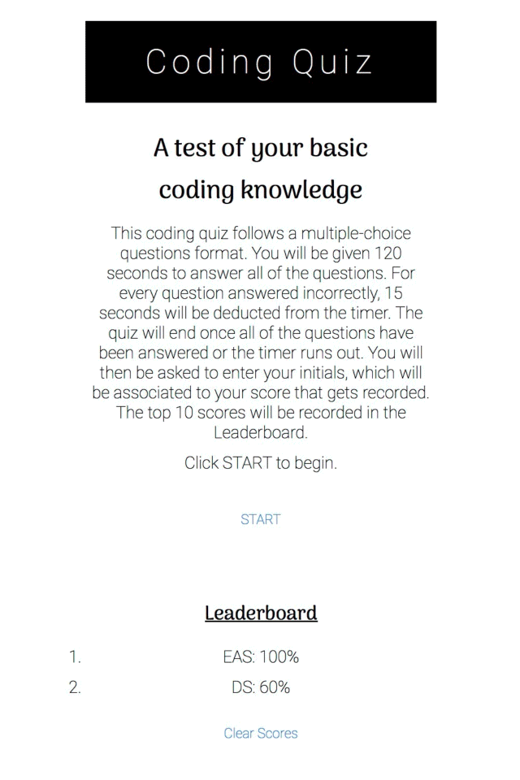

# Code Quiz
Columbia Module 4 Challenge: Web APIs

## User Story

AS A coding boot camp student,
I WANT to take a timed quiz on JavaScript fundamentals that stores high scores,
SO THAT I can gauge my progress compared to my peers.

## Acceptance Criteria

GIVEN I am taking a code quiz,
WHEN I click the start button,
THEN a timer starts and I am presented with a question.
WHEN I answer a question,
THEN I am presented with another question.
WHEN I answer a question incorrectly,
THEN time is subtracted from the clock.
WHEN all questions are answered or the timer reaches 0,
THEN the game is over.
WHEN the game is over,
THEN I can save my initials and my score.

## Files

[Deployed Application](https://emsim11.github.io/code-quiz/)

[Coding Quiz Repository](https://github.com/emsim11/code-quiz)

## Description

In this Challege, I implement what I have learned in class about Web APIs in order to create a timed coding quiz with multiple-choice questions. Given that it is likely I will be asked in the future to complete a coding assessment - perhaps as part of an interview process - it is important to become familiar with these tests. I have utilized JavaScript and Web APIs to create the interactive features of the quiz, including the questions and answers, the timer, and the high scores. I have utilized HTML and CSS to create a clean, polished, and responsive user interface. I have based my multiple-choice questions on JavaScript information I have learned in the boot camp.

## Visuals

Below you will find a gif video that I have created, which displays my Coding Quiz. The first visual displays the main page that appears when the web application URL is deployed. The next visual shows how a question page appears within the quiz. The third visual displays the finished page, which allows the quiz-taker to input their initials and save their score to the Leaderboard. Please note that if you run out of time BEFORE ALL QUESTIONS ARE ANSWERED, a different page will display that says "Better luck next time!" You will NOT be able to enter your initials and submit your score to the Leaderboard if time runs out before all questions are answered.

## Installation

No installation required!

## Usage

Use this Coding Quiz as a way to asses your basic knowledge about JavaScript! It has a user-friendly display, and informs you whether or not you answered the question correctly by displaying either "✔️" or "𝑥" below the answer choices. To begin the game, click the "START" button. Advance through the quiz by selecting the answer choice which you believe to be the correct one. Once all ten questions have been answered, please feel free to add your score to the Leaderboard by inputting your initials and clicking the "Submit Score" button! Please **note** that the option to enter your initials to submit your score to the leaderboard will only be available **if you complete all ten questions before time runs out!**

## Authors and Acknowledgment

Main Contributor: Emily A. Simone

CSS Styling Inspiration: Thank you [twqueen](https://github.com/twqueen)!

## License

This application is licensed under the MIT License - see the LICENSE file for details.